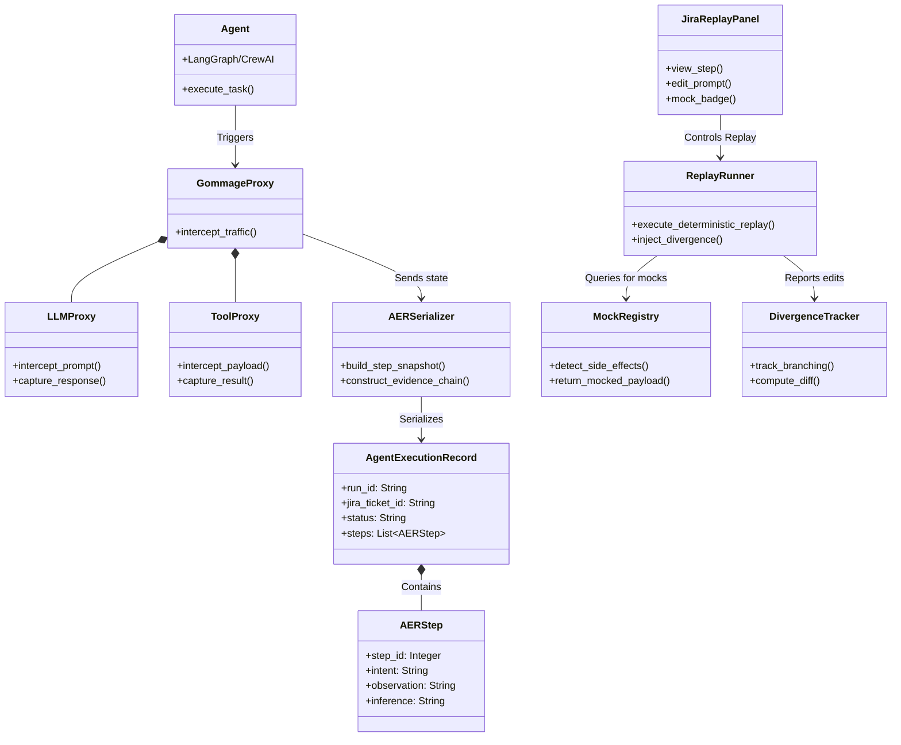

# Gommage — Agent Execution Tracer & Deterministic Replay Engine

> _An enterprise-grade observability and debugging infrastructure layer that captures the exact state, tool calls, and trajectories of AI agents._

---

<div align="center">


[]()
[]()
[]()
[]()

</div>

---

## Table of Contents

- [The Problem](#-the-problem)
- [The Solution](#-the-solution)
- [Core Features](#-core-features)
- [Architecture](#-architecture)
- [Project Structure](#-project-structure)
- [Tech Stack](#-tech-stack)
- [Getting Started](#-getting-started)
- [Demo Scenarios](#-demo-scenarios)
- [Acceptance Criteria Status](#-acceptance-criteria-status)
- [Evaluation Methodology](#-evaluation-methodology)
- [5-Day Execution Plan](#-5-day-execution-plan)

---

## The Problem

When a traditional software system fails, you look at the stack trace, reproduce the bug, and fix it.

When an **agentic AI fails in production**, a log file is not enough.

```
  Traditional Debugging of AI Agents

  1. Agent fails on JIRA-4421 (wrong SQL, email sent, ticket corrupted)
  2. Engineer re-runs the agent to debug
  3. Agent makes DIFFERENT decisions this time
  4. Worse: it sends another email during the debug session
  5. The original failure is unreproducible. The damage is compounded.
```

Three critical gaps exist today:

| Gap                           | Impact                                  |
| ----------------------------- | --------------------------------------- |
| **No deterministic replay**   | Can't reproduce the exact failure state |
| **Side effects during debug** | Debugging causes new production damage  |
| **No state inspection**       | Can't see what the LLM saw at each step |

---

## The Solution

**gommage** is an infrastructure-layer proxy that wraps your AI agent without modifying its core architecture. It operates in two modes:


Every recorded trace is:

- **Attached to the originating Jira ticket** as a structured artifact
- **Inspectable step-by-step** via an embedded Replay UI panel in Jira
- **Editable at any step** — modify a prompt or inject a corrected tool response, then let the agent continue from that point

---

## Core Features

### 1. Trajectory Recording

Transparent interception of every LLM call, tool call, context variable, and API response during a live agent run.

- Captures: prompt, system message, tool parameters, tool return, latency, token count
- Storage format: structured **Agent Execution Record (AER)** — a normalized, queryable JSON schema inspired by Vispute (2026). This includes reasoning provenance (intent, observation, inference), versioned plans with revision rationale, evidence chains with structured verdicts, and delegation authority chains.
- Transport-Layer Verification: Independent interception of tool calls at the stdio, shell, and filesystem layers to post-hoc reconcile self-reported AER fields against ground-truth execution data.
- Zero modification to the agent's architecture; operates as a middleware proxy

### 2. Deterministic Replay

Re-execute any recorded run step-by-step. All tool calls return their recorded payloads instead of hitting live APIs.

- **Mock Registry**: automatically detects side-effecting tools (email, Slack, DB writes) and flags them
- **Safe-by-default**: mocked tools return their original payload but do not execute
- **Replay fidelity**: the agent sees an identical context at each step as during the original run

### 3. State Inspection

Drill into any step and inspect the exact prompt, context window, tool parameters, and LLM output.

- Step-level snapshot viewer in the Jira Replay Panel
- Diff view: compare original vs. modified trajectory side-by-side
- Token-level visibility: see what the LLM received and what it generated

### 4. Divergence Editing

Modify any prompt or inject a corrected tool response during replay, then let the agent continue its trajectory with the original remaining recorded responses.

- Step-level prompt editor
- Tool response injection at any point in the trace
- Branch visualization: original path vs. modified path rendered as a graph

### 5. Jira-Native UX

Everything lives in Jira. No external dashboard required during a demo.

- Failure trace auto-attached to the originating Jira ticket
- "Replay in Debug Mode" button in the ticket's sidebar panel
- Post-debug: one-click creation of a linked Jira issue for the prompt fix, with the trace as evidence

---

## Architecture



---

## Project Structure

```
gommage/
│
├── README.md                        # This file
│
├── recorder/                        # Core recording infrastructure
│   ├── proxy/
│   │   ├── llm_proxy.py             # [PLACEHOLDER] Intercepts LLM calls
│   │   ├── tool_proxy.py            # [PLACEHOLDER] Intercepts tool calls
│   │   └── mock_registry.py         # [PLACEHOLDER] Side-effect detection & mocking
│   ├── serializer/
│   │   ├── aer_schema.py            # Agent Execution Record schema (Vispute 2026)
│   │   ├── step_snapshot.py         # [PLACEHOLDER] Per-step state serializer
│   │   └── evidence_chain.py        # [PLACEHOLDER] Evidence chain builder
│   └── storage/
│       ├── local_store.py           # [PLACEHOLDER] Local file-based AER storage
│       └── jira_attachment.py       # [PLACEHOLDER] Attaches trace to Jira ticket
│
├── replay/                          # Replay engine
│   ├── engine/
│   │   ├── replay_runner.py         # [PLACEHOLDER] Deterministic replay orchestrator
│   │   ├── step_editor.py           # [PLACEHOLDER] Prompt / tool injection at step N
│   │   └── divergence_tracker.py    # [PLACEHOLDER] Tracks branching from original path
│   └── ui/
│       ├── jira_panel/
│       │   ├── panel_plugin.js      # [PLACEHOLDER] Jira Forge / Connect plugin
│       │   ├── StepViewer.jsx       # [PLACEHOLDER] Step-by-step inspection component
│       │   ├── PromptEditor.jsx     # [PLACEHOLDER] Inline prompt editing at step N
│       │   ├── DiffViewer.jsx       # [PLACEHOLDER] Original vs. modified path diff
│       │   └── MockBadge.jsx        # [PLACEHOLDER] Visual badge for mocked tool calls
│       └── assets/
│           └── styles.css           # [PLACEHOLDER] Panel styles
│
├── agent/                           # Demo agent (target system for hackathon demo)
│   ├── jira_triage_agent.py         # [PLACEHOLDER] Sample Jira triage agent
│   ├── confluence_audit_agent.py    # [PLACEHOLDER] Sample Confluence audit agent
│   └── tools/
│       ├── jira_tools.py            # [PLACEHOLDER] Jira API tool wrappers
│       ├── email_tool.py            # [PLACEHOLDER] Email tool (mocked in replay)
│       └── db_tool.py               # [PLACEHOLDER] DB query tool
│
├── evaluation/                      # Evaluation framework
│   ├── test_cases/
│   │   ├── scenario_a_side_effect.json   # [PLACEHOLDER] Side-effect trap scenario
│   │   ├── scenario_b_divergence.json    # [PLACEHOLDER] Divergence testing scenario
│   │   └── scenario_c_compliance.json    # [PLACEHOLDER] Audit & compliance scenario
│   ├── metrics/
│   │   ├── replay_fidelity.py       # [PLACEHOLDER] Measures determinism of replay
│   │   └── mock_recall.py           # [PLACEHOLDER] Measures side-effect detection rate
│   └── eval_runner.py               # [PLACEHOLDER] Runs full evaluation suite
│
├── docs/
│   ├── architecture_diagram.png     # [PLACEHOLDER] System architecture diagram
│   ├── technical_spec.pdf           # [PLACEHOLDER] Technical justification document
│   ├── adr/
│   │   └── 001-proxy-approach.md    # [PLACEHOLDER] Architecture Decision Record
│   └── data_description.md          # [PLACEHOLDER] Data sources, formats, sensitivity
│
├── tests/
│   ├── test_proxy.py                # [PLACEHOLDER] Unit tests for proxy layer
│   ├── test_replay.py               # [PLACEHOLDER] Unit tests for replay engine
│   └── test_aer_schema.py           # [PLACEHOLDER] Unit tests for AER schema
│
├── pyproject.toml                   # [PLACEHOLDER] Python project configuration
├── requirements.txt                 # [PLACEHOLDER] Python dependencies
├── .env.example                     # [PLACEHOLDER] Environment variables template
└── docker-compose.yml               # [PLACEHOLDER] Local dev environment
```

---

## Tech Stack

| Layer                | Technology                            | Rationale                                                       |
| -------------------- | ------------------------------------- | --------------------------------------------------------------- |
| **Agent Framework**  | LangGraph / LangChain                 | Native tool-call interception hooks; checkpointer compatibility |
| **Proxy Layer**      | Python middleware + MCP interceptor   | Language-native; wraps both REST and MCP tool calls             |
| **AER Schema**       | Pydantic v2 + JSON                    | Structured, queryable, type-safe step records                   |
| **Storage**          | SQLite (local) / PostgreSQL (scale)   | Queryable trace store; file-based fallback for air-gap          |
| **Jira Integration** | Atlassian Forge (UI Kit 2)            | Native Jira panel; no external hosting required                 |
| **Replay UI**        | React (Forge UI Kit)                  | Component-level step viewer, diff, editor                       |
| **Evaluation**       | Pytest + custom harness               | Determinism scoring, mock recall, fidelity metrics              |

---

## Getting Started

The current MVP is dependency-light: runtime code uses the Python standard
library, while the test suite uses pytest.

### Prerequisites

```bash
# Python 3.11+
python --version

# Node.js 18+ (for Jira Forge plugin)
node --version

# Atlassian Forge CLI
npm install -g @forge/cli
forge --version
```

### Installation

```bash
# Clone the repository
git clone https://github.com/[TEAM]/gommage.git
cd gommage

# Install Python dependencies
pip install -r requirements.txt

# Copy and configure environment variables
cp .env.example .env
# → Fill in: ANTHROPIC_API_KEY, JIRA_CLOUD_URL, JIRA_API_TOKEN

# Record a local demo trace
python main.py record-demo --ticket DEMO-101

# Replay a stored trace without triggering side-effecting tools
python main.py replay <run_id>

# Run the synthetic evaluation suite
python main.py eval

# Start the local browser UI
python main.py ui

# Build the Jira-native Forge issue panel
cd replay/ui/forge
npm install
npm run build
forge register
forge variables set GOMMAGE_BACKEND_URL https://YOUR-HTTPS-GOMMAGE-BACKEND
forge deploy
forge install --product jira
```

### Running the Demo

```bash
# Step 1: Record a demo agent run
python main.py record-demo --ticket DEMO-101

# Step 2: Open Jira and find the trace attached to DEMO-101
# Step 3: Click "Replay in Debug Mode" in the ticket sidebar
# Step 4: Edit the prompt at Step 4, click Continue
# Step 5: Observe the agent take a safer path — no email sent
```

### Local Browser UI

```bash
source .venv/bin/activate
python main.py ui
```

Open `http://127.0.0.1:8010`, click `Record live run`, inspect the recorded
`email.send` tool call, then click `Replay safely` to confirm the side effect is
blocked during replay.

### Jira-Native Panel

The Jira-native version lives in `replay/ui/forge`. It declares a Forge
`jira:issuePanel` called `Gommage Replay`. Inside Jira, the panel reads the
current issue key from Forge context, records/replays through the Gommage
backend, attaches the AER JSON trace to the issue, and can create a linked Jira
fix issue with the trace attached as evidence.

For local demos, expose the Python backend through an HTTPS tunnel before
deploying Forge:

```bash
python main.py ui --host 0.0.0.0 --port 8010
ngrok http 8010
```

Then set `GOMMAGE_BACKEND_URL` to the tunnel URL in Forge.

---

## Demo Scenarios

### Scenario A — The Side-Effect Trap

An agent audits a Confluence page and drafts an aggressive email to its owner. The email tool call is **automatically mocked** during replay. The engineer edits the system prompt at step 4 and watches the agent produce a polite email instead — **no mail ever sent**.

### Scenario B — Divergence Testing 

An agent fails to resolve a JSM ticket due to incorrect SQL syntax. The engineer **injects the correct SQL** at the exact failure step and lets the agent continue its trajectory using the original recorded database responses for all other steps.

### Scenario C — Compliance Audit 

A compliance officer needs to understand what context an agent had when it approved a sensitive workflow 3 weeks ago. The AER trace provides a **perfectly preserved state snapshot** of that exact run, queryable and inspectable.

---

## Acceptance Criteria Status

| Criterion                                                            | Priority   | Status     |
| -------------------------------------------------------------------- | ---------- | ---------- |
| Record functionality: captures at least one LLM call + one tool call | **Must**   | Implemented in MVP |
| Deterministic replay without triggering live tools                   | **Must**   | Implemented in MVP |
| State inspection: exact prompt visible at any step                   | **Must**   | Implemented in schema/UI |
| Divergence editing: modify prompt/tool result, agent takes new path  | **Should** | Implemented for replay branches |
| Jira-native: trace auto-attached to originating ticket               | **Bonus**  | Local attachment adapter implemented |
| Side-effect mock registry with visual badge                          | **Bonus**  | Implemented in registry/UI |

---

## Evaluation Methodology

We define two primary metrics for the gommage system itself:

### Metric 1 — Replay Fidelity Score (RFS)

Measures whether a replay run produces identical intermediate states as the original.

```
RFS = (steps with identical LLM input context) / (total replay steps)
Target: RFS ≥ 0.95 on synthetic test suite
```

### Metric 2 — Mock Recall Rate (MRR)

Measures whether side-effecting tool calls are correctly detected and mocked.

```
MRR = (side-effecting calls correctly mocked) / (total side-effecting calls)
Target: MRR = 1.0 (zero false negatives — no accidental live calls during debug)
```

Evaluation runs on a synthetic test suite of **[PLACEHOLDER: N] recorded agent traces** covering the three demo scenarios, designed to be deterministically reproducible.

---

## 5-Day Execution Plan

| Day       | Focus                        | Deliverables                                                            |
| --------- | ---------------------------- | ----------------------------------------------------------------------- |
| **Day 1** | Infrastructure skeleton      | AER schema, LLM proxy stub, tool proxy stub, Jira ticket attachment     |
| **Day 2** | Recording pipeline           | Full trajectory recording on demo agent, SQLite storage, step snapshots |
| **Day 3** | Replay engine                | Deterministic replay runner, mock registry, divergence tracker          |
| **Day 4** | Jira UI + divergence editing | Forge panel with StepViewer, PromptEditor, MockBadge; diff view         |
| **Day 5** | Evaluation + polish          | Eval suite (RFS + MRR), end-to-end demo recording, README finalization  |

---

## References

- Vispute, N. (2026). _Reasoning Provenance for Autonomous AI Agents: Structured Behavioral Analytics Beyond State Checkpoints and Execution Traces._ arXiv:2603.21692. Oracle Cloud Infrastructure.
- AINS Hackathon 2026 — Technical Specification, Use Case 2: Agent Execution Tracer and Deterministic Replay Engine.
- LangGraph Checkpointer Documentation — State persistence and time-travel debugging.
- Atlassian Forge Developer Documentation — Jira UI Kit 2, panel extensions.

---

<div align="center">

_Built for AINS Hackathon 2026 · Organised by AINS 4.0 in partnership with Vectors_

</div>
