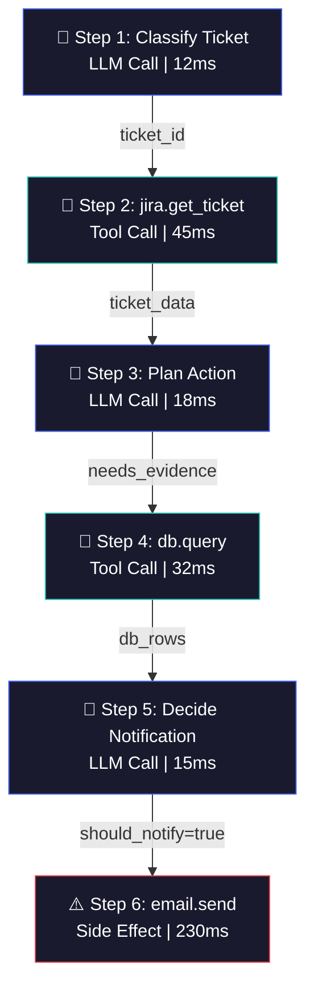

# Gommage Debug Tool — Brainstorm

> **Context**: Extending the Gommage replay engine into a full **Jira-native debug tool** for the Jira triage agent. No Jira Premium available. A demo agent will be built alongside to showcase the tooling.

---

## 1. The Big Picture

```
┌─────────────────────────────────────────────────────────────────┐
│                    Gommage Debug Dashboard                      │
│                                                                 │
│  ┌─────────────┐  ┌───────────────────┐  ┌──────────────────┐  │
│  │  Trace List  │  │   Radar / Stats   │  │  AER DAG View    │  │
│  │  (history)   │  │   (aggregate)     │  │  (single/multi)  │  │
│  └──────┬───────┘  └───────────────────┘  └──────────────────┘  │
│         │                                                       │
│         ▼                                                       │
│  ┌──────────────────────────────────────────────────────────────┐│
│  │              Trace Inspector / Replay Panel                  ││
│  │  ┌──────┐  ┌──────────┐  ┌───────────┐  ┌───────────────┐  ││
│  │  │ Step │→ │ Thinking │→ │ Tool Exec │→ │ State Diff    │  ││
│  │  │ Nav  │  │ Viewer   │  │ Sandbox   │  │ (git-style)   │  ││
│  │  └──────┘  └──────────┘  └───────────┘  └───────────────┘  ││
│  └──────────────────────────────────────────────────────────────┘│
└─────────────────────────────────────────────────────────────────┘
```

We're building three layers:

1. **Dashboard Board View** — trace list, aggregate stats, radar chart
2. **Trace Inspector** — step-through replay, thinking viewer, state diffs
3. **AER DAG Visualizer** — single-trace and multi-trace aggregated flow graphs

---

## 2. Jira Integration Without Premium

### What We Can't Use (Premium-only)

- Advanced Roadmaps / Plans
- Cross-project automation rules (premium tier)
- Assets / CMDB
- Deployment gating

### What We _Can_ Use (Free / Standard)

| Capability                                   | How We Use It                                                                        |
| -------------------------------------------- | ------------------------------------------------------------------------------------ |
| **Jira REST API v3**                         | Full CRUD on issues, comments, attachments, transitions, search (JQL)                |
| **Atlassian Forge (free to develop/deploy)** | `jira:issuePanel` module for the Replay Panel, `jira:globalPage` for the dashboard   |
| **Forge Custom UI**                          | Full React app inside Jira — our main surface                                        |
| **Forge Storage API**                        | 10 GB per app — store trace metadata, DAG indexes                                    |
| **Issue Attachments**                        | Store full AER JSON traces as attachments on the originating ticket                  |
| **Issue Properties**                         | Store lightweight trace metadata (run_id, status, step count) as entity properties   |
| **Webhooks**                                 | Trigger recording on issue transitions (e.g., auto-record when status → "In Triage") |
| **Issue Links**                              | Link "Debug Trace" issues to originals, link fix issues back                         |
| **Labels & Custom Fields**                   | Tag issues with `gommage:traced`, `gommage:has-failure`, etc.                        |

### Architecture: Forge App Modules

```
manifest.yml
├── jira:globalPage       →  "Gommage Debug Dashboard"    (the main board)
├── jira:issuePanel       →  "Gommage Replay"             (per-issue trace inspector)
├── jira:issueActivity    →  Trace timeline in activity    (optional, lightweight)
└── trigger:              →  on issue transition           (auto-record hook)
```

> **KEY INSIGHT**: `jira:globalPage` is the key module. It gives us a **full-page app inside Jira** (accessible from the left sidebar), which is where the dashboard/board lives. This is available on **all Jira plans** including Free.

### Backend Topology

```
Forge Custom UI (React)
        │
        ▼
Forge Resolver Functions (serverless)
        │
        ├─→ Forge Storage API  (trace metadata, DAG indexes, user preferences)
        ├─→ Jira REST API      (issue properties, attachments, links)
        └─→ Gommage Backend    (Python, via HTTPS tunnel or hosted)
                │
                ├─→ Local AER Store (SQLite / JSON files)
                ├─→ Replay Engine
                └─→ DAG Builder
```

---

## 3. Main Board — Dashboard Design

The `jira:globalPage` dashboard is the command center. It has four main sections:

### 3.1 Trace List (Past Executions)

A filterable, sortable table of all recorded agent runs.

| Column       | Source                                                           |
| ------------ | ---------------------------------------------------------------- |
| Run ID       | `AgentExecutionRecord.run_id`                                    |
| Ticket       | `jira_ticket_id` — clickable link to the issue                   |
| Agent        | `agent_name`                                                     |
| Status       | `status` with color badges: ✅ completed, ❌ failure, ⚠️ partial |
| Steps        | `len(steps)`                                                     |
| Side Effects | count of `step.tool.side_effecting == True`                      |
| Duration     | `completed_at - started_at`                                      |
| LLM Calls    | count of `kind == "llm"` steps                                   |
| Tool Calls   | count of `kind == "tool"` steps                                  |
| Timestamp    | `started_at`, human-readable relative time                       |

**Filters**: ticket ID, agent name, status, date range, has-side-effects
**Actions**: click row → opens Trace Inspector; multi-select → opens DAG Comparator

### 3.2 Radar Plot — Agent Task Distribution

A radar (spider) chart showing the **distribution of what the agent does** across executions. Axes are automatically annotated from the AER data:

**Proposed Axes** (auto-derived from traces):

- **Information Gathering** — count of read-only tool calls (`jira.get_ticket`, `db.query`)
- **Decision Making** — count of LLM calls with `intent` containing classify/decide/triage keywords
- **Communication** — count of side-effecting communication tools (`email.send`, `slack.post`)
- **Data Mutation** — count of write-oriented tool calls (`jira.update_ticket`, `db.execute`)
- **Evidence Collection** — count of steps with non-empty `evidence` chains
- **Error Recovery** — count of tool calls with `error != None` followed by retry patterns

**Auto-annotation algorithm**:

```python
def classify_step(step: AERStep) -> str:
    """Classify a step into a radar category."""
    if step.kind == "llm":
        # Use intent keywords to classify
        intent = (step.intent or "").lower()
        if any(kw in intent for kw in ["classify", "decide", "triage", "plan"]):
            return "decision_making"
        return "reasoning"
    if step.kind == "tool":
        tool = step.tool
        if tool.side_effecting:
            if tool.tool_name in COMMUNICATION_TOOLS:
                return "communication"
            return "data_mutation"
        if tool.error:
            return "error_recovery"
        return "information_gathering"
    if step.kind == "observation" and step.evidence:
        return "evidence_collection"
    return "other"
```

**Overlay mode**: Select multiple traces to overlay their radar shapes — immediately see behavioral drift (e.g., "this week's runs are heavier on communication, lighter on evidence collection").

### 3.3 Metrics Cards

Four cards across the top of the dashboard:

| Card                  | Metric                       | Computation                                        |
| --------------------- | ---------------------------- | -------------------------------------------------- |
| **Avg Latency**       | Mean end-to-end duration     | `mean(completed_at - started_at)` across traces    |
| **Tool Execs**        | Total tool calls             | `sum(count(kind=="tool") for trace in traces)`     |
| **Tool Error Rate**   | % of tool calls that errored | `count(tool.error != None) / count(kind=="tool")`  |
| **Avg Tool Duration** | Mean tool call latency       | `mean(step.tool.latency_ms)` across all tool steps |

Each card also shows a **sparkline** (last 20 traces) to show the trend.

### 3.4 Activity Stream

A real-time feed of recent events:

- "🔴 Run `run-a1b2c3` failed on `PROJ-42` — email.send returned 500"
- "🟢 Run `run-d4e5f6` completed on `PROJ-17` — 0 side effects"
- "🔀 Divergence detected: `run-g7h8i9` forked at step 4"

---

## 4. Trace Inspector — Step-Through Replay UI

When you click a trace, you enter the inspector. This is the core debugging interface.

### 4.1 Step Timeline

A horizontal timeline or vertical step list showing the execution flow:

```
[1: LLM 🧠]──→[2: Tool 🔧]──→[3: LLM 🧠]──→[4: Tool ⚠️]──→[5: LLM 🧠]
  Classify      get_ticket     Plan action    email.send     Summarize
  12ms          45ms           18ms           230ms          15ms
```

Each step is color-coded:

- 🧠 Blue = LLM call
- 🔧 Green = read-only tool
- ⚠️ Amber = side-effecting tool
- 🔴 Red = errored tool call
- 🟣 Purple = mocked during replay
- 🔀 Orange = divergence edit point

### 4.2 Step Detail Panel

Clicking a step shows:

**For LLM steps:**

- System message (collapsible)
- User prompt (full text, syntax highlighted)
- LLM response (full text)
- Context object (JSON tree viewer)
- Intent / Observation / Inference (reasoning provenance fields)
- Token count, latency, model name

**For Tool steps:**

- Tool name + side-effect badge
- Input parameters (JSON tree)
- Output result (JSON tree or formatted)
- Latency, error (if any)
- Mock status (if replayed: "🟣 Mocked — original response returned without execution")

### 4.3 State Diff View (Git-style)

This is the crucial debugging view. Two modes:

#### Mode A: Step-by-step diff

Shows what **changed** in the agent's context/state between step N and step N+1:

```diff
  Context at Step 3:
  {
    "ticket_id": "PROJ-42",
    "priority": "high",
-   "assignee": null,
+   "assignee": "alice@example.com",
    "labels": ["triage-pending"],
+   "db_evidence": [{"export_id": 7, "status": "failed"}]
  }
```

#### Mode B: Original vs. Divergence diff

When a replay has been edited, show the original path alongside the modified path:

```diff
  Step 4 (Original):
- email.send(to="bob@example.com", subject="Follow-up needed for PROJ-42")

  Step 4' (Modified):
+ email.send(to="alice@example.com", subject="Review requested for PROJ-42")
```

### 4.4 Thinking Viewer

A dedicated panel that shows the LLM's reasoning chain across the trace. This is an **aggregated view** of all `intent`, `observation`, and `inference` fields, rendered as a conversational flow:

```
Step 1 — Intent: "Load ticket context"
         Observation: "Ticket PROJ-42 is high priority, unassigned, reporter is Bob"

Step 2 — Intent: "Classify ticket"
         Inference: "This is an export failure. Need database evidence before escalating."

Step 3 — Intent: "Gather database evidence"
         Observation: "Found 3 failed exports in last 24h for this ticket"
         Inference: "Pattern suggests migration issue. Owner notification warranted."

Step 4 — Intent: "Notify owner"
         [⚠️ SIDE EFFECT: email.send]
```

---

## 5. Sandbox Strategy — Tool Execution Isolation

Three approaches, each with clear trade-offs. We should **implement Approach A first**, then consider B and C as upgrades.

### Approach A: Record & Replay (Recommended for MVP)

**Mechanism**: During replay, tool calls return their **recorded response** from the AER trace. The tool function is never actually invoked.

```python
class ReplayToolProxy:
    """Intercepts tool calls during replay and returns recorded responses."""

    def __init__(self, recorded_steps: list[AERStep]):
        self._step_index = 0
        self._recorded = {s.step_id: s for s in recorded_steps if s.tool}

    def execute(self, tool_name: str, params: dict, step_id: int) -> Any:
        recorded = self._recorded[step_id]
        assert recorded.tool.tool_name == tool_name
        # Return the recorded result — tool never actually runs
        return recorded.tool.result
```

| Pros                                      | Cons                                                                                  |
| ----------------------------------------- | ------------------------------------------------------------------------------------- |
| Zero cost — no environment duplication    | Cannot fork replay and explore alternative tool behaviors                             |
| Perfectly deterministic                   | Tool responses are frozen; can't ask "what if the DB returned different data?"        |
| Already 80% implemented in `ReplayRunner` | If agent takes a divergent path, may request a tool call that wasn't in the recording |
| No risk of side effects by construction   | —                                                                                     |

**When divergence hits an unrecorded tool call**: The replay engine should surface a UI prompt: _"The agent wants to call `jira.get_ticket(PROJ-99)` which was not in the original recording. Choose: (a) Provide a manual response, (b) Execute live (unsafe), (c) Abort replay."_

### Approach B: Copy-on-Write Sandbox

**Mechanism**: Create a shallow copy of the project state at replay start. Tool calls are routed to the sandbox copy. State mutations only affect the sandbox.

```python
class SandboxEnvironment:
    """Shallow-copy sandbox for tool execution during replay."""

    def __init__(self, original_state: dict):
        # Copy-on-write: shallow clone, deep copy only on mutation
        self._state = copy.copy(original_state)
        self._mutations = []

    def get(self, key):
        return self._state[key]

    def set(self, key, value):
        self._mutations.append({"key": key, "old": self._state.get(key), "new": value})
        self._state[key] = value
```

| Pros                                            | Cons                                     |
| ----------------------------------------------- | ---------------------------------------- |
| Can fork and explore alternative tool behaviors | Must model the entire Jira project state |
| Supports "what if" scenarios                    | Expensive for large projects             |
| Allows testing new tool implementations         | Complex to keep sandbox consistent       |

**Practical concern**: For Jira, the "project state" is the entire issue graph — tickets, comments, attachments, transitions, boards, sprints. A deep copy is impractical. Instead, use a **virtual overlay**:

```
Real Jira (read-only) ← Sandbox Layer (intercepts writes, stores diffs)
                         │
                         ├── Intercepted: createIssue → stored in sandbox DB
                         ├── Intercepted: updateIssue → stored as diff
                         ├── Pass-through: getIssue  → read from real Jira (if not in sandbox)
                         └── Intercepted: sendEmail  → logged but not sent
```

### Approach C: Hybrid (Record & Replay + Fork-on-Demand)

**Mechanism**: Start with Approach A (recorded responses). When the user explicitly forks at a step, switch to Approach B from that point forward.

```
Steps 1-3: Record & Replay (frozen recorded responses)
           │
           └─→ User edits prompt at Step 3
               │
               Steps 4+: Sandbox mode
               ├── LLM calls: live (new completion with edited prompt)
               ├── Read tools: live against real Jira (read-only)
               └── Write tools: intercepted → sandbox overlay
```

This is the **recommended long-term architecture**. It's the cheapest path that still supports full exploration.

### Tool Decorator Design

```python
def gommage_tool(name: str, record: AgentExecutionRecord, mode: str = "record"):
    """
    Decorator that routes tool calls based on mode:
    - "record":  execute live + capture to AER
    - "replay":  return recorded response (skip execution)
    - "sandbox": route to sandbox environment
    """
    def decorator(fn):
        @functools.wraps(fn)
        def wrapper(*args, **kwargs):
            if mode == "replay":
                return _get_recorded_response(record, name, kwargs)
            if mode == "sandbox":
                return _execute_in_sandbox(fn, kwargs)
            # mode == "record"
            result = fn(*args, **kwargs)
            _record_step(record, name, kwargs, result)
            return result
        return wrapper
    return decorator
```

---

## 6. AER as a DAG — Visualization

### Can the AER be Visualized as a DAG? — Yes, naturally.

The AER is a sequence of steps, but it has **implicit DAG structure** through:

1. **Data dependencies**: Step 3 uses the output of Step 1 (e.g., `db.query` uses the `ticket_id` from `jira.get_ticket`)
2. **Causal chains**: LLM decisions at Step 2 determine which tools are called at Step 3
3. **Evidence links**: The `evidence_chain` field creates explicit back-references
4. **Divergence branches**: When a replay forks, the original and modified paths form a tree

### Single-Trace DAG



### Building Data Dependencies Automatically

The DAG edges are inferred, not manually specified. Algorithm:

```python
def build_dag(record: AgentExecutionRecord) -> dict[int, list[int]]:
    """Build a DAG of data dependencies between steps."""
    edges = {}
    produced_keys: dict[str, int] = {}  # key -> step_id that produced it

    for step in record.steps:
        deps = set()

        # Check if this step's context references outputs from previous steps
        for key, value in step.context.items():
            if key in produced_keys:
                deps.add(produced_keys[key])

        # Check evidence chain back-references
        for evidence in step.evidence:
            if evidence.source.startswith("step:"):
                deps.add(int(evidence.source.split(":")[1]))

        edges[step.step_id] = list(deps)

        # Register what this step produces
        if step.tool and step.tool.result:
            produced_keys[step.tool.tool_name] = step.step_id
        if step.llm:
            produced_keys[f"llm_decision_{step.step_id}"] = step.step_id

    return edges
```

### Divergence in the DAG

When a replay forks, the DAG becomes a **tree with shared prefix**:

```
            [Step 1] ── [Step 2] ── [Step 3]
                                       │
                            ┌──────────┴──────────┐
                            ▼                     ▼
                      [Step 4: Original]    [Step 4': Edited]
                            │                     │
                      [Step 5: Original]    [Step 5': New Path]
                            │                     │
                      [Step 6: email.send]  [Step 6': slack.post]
```

---

## 7. Multi-Trace DAG Aggregation — The Killer Feature

### The Idea

Aggregate DAGs from multiple traces into a **single merged flow graph** that reveals:

- **Common paths**: Steps that appear in most/all traces (the "happy path")
- **Divergence points**: Where traces split into different behaviors
- **Convergence points**: Where different paths rejoin to the same outcome
- **Frequency**: How often each edge is traversed (heatmap coloring)
- **Anomalies**: Rare paths that occur in < 5% of traces

### Visual Concept

```
                    ┌─────────────┐
                    │ get_ticket  │  100% (all 47 traces)
                    └──────┬──────┘
                           │
                    ┌──────┴──────┐
                    │  classify   │  100%
                    └──────┬──────┘
                           │
               ┌───────────┼───────────┐
               │           │           │
         ┌─────┴─────┐ ┌──┴──┐  ┌─────┴──────┐
         │ db.query   │ │skip │  │ jira.search │
         │ (72%)      │ │(8%) │  │ (20%)       │
         └─────┬──────┘ └──┬──┘  └─────┬───────┘
               │           │           │
               └───────────┼───────────┘
                           │           ← CONVERGENCE
                    ┌──────┴──────┐
                    │   decide    │  100%
                    └──────┬──────┘
                           │
                  ┌────────┼────────┐
                  │                 │
           ┌──────┴──────┐  ┌──────┴──────┐
           │ email.send  │  │  no action  │
           │  (64%)      │  │  (36%)      │
           └─────────────┘  └─────────────┘
```

### Implementation: Trie-Based Trace Aggregation

Traces are sequences of steps. Aggregation works like a **trie (prefix tree)** but generalized for DAGs:

```python
@dataclass
class AggregateNode:
    """A node in the aggregated DAG."""
    node_id: str                    # Canonical ID (e.g., "classify:llm")
    step_kind: StepKind
    label: str                      # Display label (tool name or intent)
    trace_ids: set[str]             # Which traces pass through this node
    frequency: float                # len(trace_ids) / total_traces
    avg_latency_ms: float
    error_rate: float
    children: dict[str, "AggregateEdge"]

@dataclass
class AggregateEdge:
    source: str
    target: str
    trace_ids: set[str]
    frequency: float
    data_keys: set[str]             # What data flows along this edge

def aggregate_traces(records: list[AgentExecutionRecord]) -> AggregateDAG:
    """
    Build an aggregated DAG from multiple traces.

    Algorithm:
    1. Canonicalize each step to a node signature
       - LLM steps: hash(intent + system_message_prefix)
       - Tool steps: tool_name + sorted(param_keys)
    2. For each trace, walk the step sequence and create edges
    3. Merge nodes with matching signatures
    4. Compute frequencies, avg latencies, error rates
    """
    dag = AggregateDAG()
    total = len(records)

    for record in records:
        prev_node_id = "START"
        for step in record.steps:
            node_id = canonicalize_step(step)
            dag.add_node(node_id, step, record.run_id)
            dag.add_edge(prev_node_id, node_id, record.run_id)
            prev_node_id = node_id
        dag.add_edge(prev_node_id, "END", record.run_id)

    dag.compute_frequencies(total)
    return dag
```

### Canonicalization Strategy

The key challenge is deciding **when two steps from different traces are "the same node"**. Too loose = everything merges; too strict = nothing merges.

| Step Kind   | Canonicalization                             | Example Signature               |
| ----------- | -------------------------------------------- | ------------------------------- |
| Tool call   | `tool_name` + sorted param keys (not values) | `"jira.get_ticket:{ticket_id}"` |
| LLM call    | `intent` keyword bucket                      | `"classify_ticket"`             |
| Observation | `evidence.source` pattern                    | `"observe:db_result"`           |
| Decision    | `inference` keyword bucket                   | `"decide:notify_owner"`         |

### Interaction: Comparing Traces in the Aggregated DAG

In the UI, the user can:

1. **Hover** a node → see which traces pass through it, avg latency, error rate
2. **Click** a node → filter the trace list to only show traces passing through that node
3. **Select two traces** → highlight their paths in different colors on the aggregated DAG
4. **Filter by outcome** → show only traces that ended in failure, or only traces that triggered email
5. **Time range** → animate the DAG to show how the flow evolved over time

---

## 8. Metrics & Observability Deep Dive

### 8.1 Latency Breakdown

```
┌────────────────────────────────────────────┐
│  Total Trace Duration: 320ms               │
│                                            │
│  ██████░░░░░░░░░░░░░░░░░  LLM: 45ms (14%) │
│  ████████████████░░░░░░░  Tools: 275ms     │
│    ├── jira.get_ticket: 45ms               │
│    ├── db.query: 32ms                      │
│    └── email.send: 198ms  ← bottleneck     │
│  ░░░░░░░░░░░░░░░░░░░░░░░ Overhead: <1ms   │
└────────────────────────────────────────────┘
```

Source: `step.tool.latency_ms` and `step.llm.latency_ms` already captured in the AER schema.

### 8.2 Tool Execution Stats

| Metric                   | Derivation                                                    |
| ------------------------ | ------------------------------------------------------------- |
| Calls per trace          | `count(step.kind == "tool")` per `AgentExecutionRecord`       |
| Error rate               | `count(step.tool.error != None) / count(step.kind == "tool")` |
| P50 / P95 / P99 duration | Percentiles of `step.tool.latency_ms` across traces           |
| Side-effect ratio        | `count(side_effecting) / count(tool calls)`                   |
| Mock coverage (replay)   | `count(mocked) / count(side_effecting)` — should be 1.0       |

### 8.3 LLM Stats

| Metric               | Derivation                                                                 |
| -------------------- | -------------------------------------------------------------------------- |
| Token efficiency     | `total_tokens / num_steps` — are we using too many tokens per decision?    |
| Reasoning depth      | `count(steps with non-empty inference)` — is the agent actually reasoning? |
| Decision consistency | Across traces for same ticket type, do intents follow the same order?      |

---

## 9. Demo Jira Agent Design

A simple but realistic agent to demonstrate the debug tool. Must be interesting enough to produce varied traces.

### Agent: `JiraTriageBot`

**Personality**: A careful support triage agent that reads incoming tickets, gathers evidence, classifies them, and takes action.

### Tool Belt

| Tool                 | Type  | Side Effect? | Description                       |
| -------------------- | ----- | ------------ | --------------------------------- |
| `jira.get_ticket`    | Read  | ❌           | Fetch ticket details              |
| `jira.search`        | Read  | ❌           | JQL search for related tickets    |
| `jira.add_comment`   | Write | ✅           | Add a triage comment              |
| `jira.update_ticket` | Write | ✅           | Change priority, assignee, labels |
| `jira.transition`    | Write | ✅           | Move ticket through workflow      |
| `db.query`           | Read  | ❌           | Query SLA/export database         |
| `email.send`         | Write | ✅           | Notify ticket owner               |
| `slack.post`         | Write | ✅           | Post to team channel              |

### Agent Flow (happy path)

```
1. Receive ticket ID
2. jira.get_ticket → load ticket details
3. LLM: Classify ticket (bug / feature / support / incident)
4. jira.search → find related/duplicate tickets
5. LLM: Assess severity and urgency
6. db.query → check SLA status and historical data
7. LLM: Plan triage action
8. jira.update_ticket → set priority, labels, assignee
9. jira.add_comment → add triage summary
10. LLM: Decide if notification needed
11. email.send OR slack.post → notify relevant parties
12. jira.transition → move to "In Progress" or "Escalated"
```

### Interesting Failure Modes (for debug tool demo)

| Scenario                 | What Goes Wrong                             | Debug Value                                                           |
| ------------------------ | ------------------------------------------- | --------------------------------------------------------------------- |
| **Wrong classification** | Agent classifies a P1 incident as a P3 bug  | Step-through the LLM reasoning to see where classification went wrong |
| **Unnecessary email**    | Agent sends email for a low-priority ticket | Inspect the decision step, see the evidence chain was thin            |
| **SQL injection**        | Agent constructs unsafe SQL in `db.query`   | Tool call inspection reveals the bad SQL string                       |
| **Duplicate triage**     | Agent doesn't find the existing duplicate   | `jira.search` JQL was too narrow — visible in tool params             |
| **Circular assignment**  | Agent assigns ticket back to the reporter   | Context diff shows the assignee logic bug                             |
| **Rate limiting**        | `email.send` fails with 429                 | Tool error + retry pattern visible in the DAG                         |

### Implementation: Keep It Simple

The demo agent should use **deterministic mode by default** (the existing `deterministic_llm` backend) so traces are reproducible for demos. When connected to a real LLM, traces become interesting because they vary.

```python
# Extending the existing agent at agent/jira_triage_agent.py
# Add more tools and decision points to make traces richer

def run_jira_triage_v2(ticket_id: str, *, issue: dict | None = None) -> AgentExecutionRecord:
    # ... existing setup ...

    # Step 1: Load ticket
    ticket = get_ticket_tool(ticket_id=ticket_id)

    # Step 2: Classify
    classification = llm.complete(
        f"Classify: {ticket['summary']}",
        intent="Classify ticket type and severity"
    )

    # Step 3: Search for duplicates (NEW)
    related = search_tool(jql=f"summary ~ '{ticket['summary']}' AND key != {ticket_id}")

    # Step 4: Gather evidence
    db_rows = db_query_tool(sql=f"SELECT * FROM sla WHERE ticket_id = '{ticket_id}'")

    # Step 5: Plan action (NEW decision point)
    plan = llm.complete(
        "Given the classification, related tickets, and SLA data, plan the triage action.",
        intent="Plan triage action",
        context={"classification": classification, "related": related, "sla": db_rows}
    )

    # Step 6: Execute triage (NEW)
    update_ticket_tool(
        ticket_id=ticket_id,
        priority=plan.get("priority"),
        labels=plan.get("labels"),
        assignee=plan.get("assignee")
    )

    # Step 7: Comment (NEW)
    add_comment_tool(ticket_id=ticket_id, body=plan.get("triage_summary"))

    # Step 8: Notify if needed
    if plan.get("should_notify"):
        email_send_tool(
            to=ticket.get("owner"),
            subject=f"Triage: {ticket_id}",
            body=plan.get("notification_body")
        )

    # Step 9: Transition (NEW)
    transition_tool(ticket_id=ticket_id, to_status=plan.get("target_status"))

    record.complete()
    return record
```

---

## 10. Rendering Technology Choices

### For the DAG Visualization

| Library          | Pros                                    | Cons                                         | Verdict                       |
| ---------------- | --------------------------------------- | -------------------------------------------- | ----------------------------- |
| **D3.js**        | Full control, beautiful custom layouts  | Steep learning curve, lots of code           | Best for custom aggregate DAG |
| **dagre-d3**     | Automatic DAG layout, d3-based          | Unmaintained, but works                      | Good for single-trace DAGs    |
| **Cytoscape.js** | Graph-native, great interactivity       | Less pretty out of the box                   | Good alternative to D3        |
| **React Flow**   | React-native, node-based editor UX      | Designed for editors, not pure visualization | Overkill                      |
| **Elk.js**       | Eclipse Layout Kernel, best auto-layout | Complex integration                          | Best layout algorithm         |
| **Mermaid**      | Simple, text-based                      | No interactivity, limited for aggregation    | Only for docs/screenshots     |

**Recommendation**: **D3.js + dagre layout** for the interactive DAG. Use dagre for automatic node positioning, D3 for rendering, interactivity, and the heatmap overlays.

### For the Radar Chart

**Chart.js** with the radar chart plugin. It's lightweight, well-documented, and has excellent React bindings (`react-chartjs-2`). Already used in many Forge apps.

### For the State Diff View

**Monaco Diff Editor** (the VS Code editor component) or **react-diff-viewer-continued**. Monaco is heavier but gives a first-class diff experience. For a lighter option, `react-diff-viewer-continued` renders beautiful side-by-side or unified diffs.

---

## 11. Data Model Extensions

### New Fields for `AERStep`

To support the dashboard metrics and DAG, a few additions to the existing schema:

```python
@dataclass(slots=True)
class AERStep:
    # ... existing fields ...

    # NEW: Category for radar chart (auto-classified)
    category: str = ""  # "information_gathering", "decision_making", etc.

    # NEW: Data dependencies (for DAG edges)
    depends_on: list[int] = field(default_factory=list)  # step_ids this step depends on
    produces: list[str] = field(default_factory=list)     # keys this step produces

    # NEW: Canonical signature (for DAG aggregation)
    canonical_id: str = ""  # e.g., "tool:jira.get_ticket:{ticket_id}"
```

### New Model: `TraceIndex`

For the dashboard to be fast, we need a pre-computed index of trace metadata:

```python
@dataclass
class TraceIndex:
    """Lightweight trace metadata for dashboard rendering."""
    run_id: str
    jira_ticket_id: str
    agent_name: str
    status: str
    started_at: str
    completed_at: str | None
    step_count: int
    llm_call_count: int
    tool_call_count: int
    tool_error_count: int
    side_effect_count: int
    total_latency_ms: int
    avg_tool_latency_ms: float
    category_distribution: dict[str, int]  # For radar chart
    canonical_path: list[str]              # For DAG aggregation
```

---

## 12. Forge App Module Manifest

```yaml
# manifest.yml
modules:
  jira:globalPage:
    - key: gommage-dashboard
      title: Gommage Debug
      resource: dashboard
      resolver:
        function: dashboard-resolver
      icon: https://...

  jira:issuePanel:
    - key: gommage-replay
      title: Gommage Replay
      resource: replay-panel
      resolver:
        function: replay-resolver
      icon: https://...

  function:
    - key: dashboard-resolver
      handler: index.dashboardResolver
    - key: replay-resolver
      handler: index.replayResolver

  consumer:
    - key: issue-transition-trigger
      resolver:
        function: auto-record
      events:
        - avi:jira:transitioned:issue

resources:
  - key: dashboard
    path: static/dashboard/build
  - key: replay-panel
    path: static/replay/build

permissions:
  scopes:
    - read:jira-work
    - write:jira-work
    - storage:app
```

---

## 13. Open Questions & Trade-offs

### Q1: Where to store traces?

| Option                                                     | Capacity         | Query Speed                | Persistence | Offline |
| ---------------------------------------------------------- | ---------------- | -------------------------- | ----------- | ------- |
| **Jira issue attachments**                                 | 10 MB/file limit | Slow (REST API)            | ✅          | ❌      |
| **Forge Storage API**                                      | 10 GB total      | Fast (native)              | ✅          | ❌      |
| **Python backend (SQLite)**                                | Unlimited        | Fastest                    | ✅          | ✅      |
| **Hybrid**: metadata in Forge Storage, full AER in backend | Best of both     | Fast list, moderate detail | ✅          | Partial |

**Recommendation**: Hybrid. Trace indexes in Forge Storage for fast dashboard rendering. Full AER JSON in the Python backend (SQLite). Optionally attach to Jira for compliance/audit.

### Q2: How to handle large aggregated DAGs?

For 100+ traces, the aggregated DAG could become noisy. Solutions:

- **Prune low-frequency edges** (< 5% of traces) by default, toggle to show
- **Collapse linear chains** (A→B→C where B has no branches) into a single node
- **Zoom levels**: overview (just decision points) → detail (all steps)
- **Cluster by outcome**: separate sub-DAGs for success vs. failure traces

### Q3: Real-time recording or batch?

- **Batch (current)**: Agent runs, completes, then trace is saved. Simple.
- **Streaming**: Steps are pushed to the dashboard as the agent runs. Live debugging.
- **Recommendation**: Start with batch. Add streaming via WebSocket as a polish feature.

### Q4: How to make the demo agent produce interesting varied traces?

- Use real LLM (OpenAI/Anthropic) for some demo runs — inherent variability
- Inject different ticket types: bug, feature, incident, support, question
- Inject different severity levels: P1 to P4
- Pre-seed "bad" tickets that trigger failure modes (missing fields, duplicate titles)
- Record 20-50 traces, curate 5-10 with interesting patterns for demo

### Q5: Forge Custom UI or UI Kit 2?

| Aspect      | UI Kit 2           | Custom UI                |
| ----------- | ------------------ | ------------------------ |
| Rendering   | Server-side React  | Client-side React        |
| Flexibility | Limited components | Full React + any library |
| D3/Chart.js | ❌ Not supported   | ✅ Full support          |
| Bundle size | Tiny               | Up to 20 MB              |
| Latency     | Faster first load  | Slightly slower          |

**Recommendation**: **Custom UI** is mandatory for our use case. We need D3 for the DAG, Chart.js for the radar, and Monaco for diffs. UI Kit 2 doesn't support any of these.

---

## 14. Implementation Roadmap

### Phase 0: Demo Agent v2 (1-2 days)

- [ ] Extend `jira_triage_agent.py` with more tools and decision points
- [ ] Add `jira.search`, `jira.add_comment`, `jira.update_ticket`, `jira.transition`, `slack.post` tools
- [ ] Create 5+ ticket fixtures that produce different trace shapes
- [ ] Record 20+ traces for dashboard/DAG development

### Phase 1: Dashboard Board (2-3 days)

- [x] Forge `jira:globalPage` scaffold
- [ ] Trace list table with filtering and sorting
- [ ] Metrics cards (latency, tool execs, error rate, tool duration)
- [ ] Sparkline trends
- [ ] Radar chart with auto-classification

### Phase 2: Trace Inspector (2-3 days)

- [x] Step timeline with color-coded badges
- [x] Step detail panel (LLM + Tool views)
- [x] State diff view (git-style)
- [ ] Thinking viewer (reasoning chain)
- [ ] Replay controls (play, pause, step, fork)

### Phase 3: AER DAG Visualizer (3-4 days)

- [x] Single-trace DAG with D3 + dagre
- [x] Data dependency inference algorithm
- [x] Divergence branch rendering
- [x] Multi-trace aggregation algorithm
- [x] Aggregated DAG with frequency heatmap
- [x] Interactive hover/click/filter

### Phase 4: Sandbox & Fork (2-3 days)

- [ ] Record & Replay mode (polish existing)
- [ ] "Unrecorded tool call" UI prompt
- [ ] Fork-on-demand: switch to sandbox mode at edit point
- [ ] Virtual overlay for Jira state (read-through + write-capture)

### Phase 5: Polish & Demo Script (1-2 days)

- [ ] End-to-end demo script with curated traces
- [ ] Screenshots and recordings
- [ ] Error states and edge cases
- [ ] Performance optimization for large trace sets

---

## 15. Summary of Key Decisions

| Decision          | Choice                                          | Rationale                                            |
| ----------------- | ----------------------------------------------- | ---------------------------------------------------- |
| Jira surface      | `jira:globalPage` + `jira:issuePanel` via Forge | No Premium needed; full React control                |
| UI framework      | Forge Custom UI (React)                         | Need D3, Chart.js, Monaco — not possible in UI Kit 2 |
| DAG library       | D3.js + dagre layout                            | Best balance of control and automatic layout         |
| Radar chart       | Chart.js + react-chartjs-2                      | Lightweight, well-documented                         |
| Diff viewer       | react-diff-viewer-continued                     | Lighter than Monaco, sufficient for JSON diffs       |
| Sandbox (MVP)     | Record & Replay                                 | Zero-cost, already 80% built, safe by construction   |
| Sandbox (future)  | Hybrid fork-on-demand                           | Only pay sandbox cost when user explicitly forks     |
| Storage           | Hybrid (Forge Storage + SQLite backend)         | Fast dashboard + full trace queryability             |
| Trace aggregation | Trie-based DAG merge with canonical signatures  | Handles shared prefixes and divergence naturally     |
| Demo agent        | Extended `JiraTriageBot` with 8+ tools          | Rich enough to produce varied, interesting traces    |
